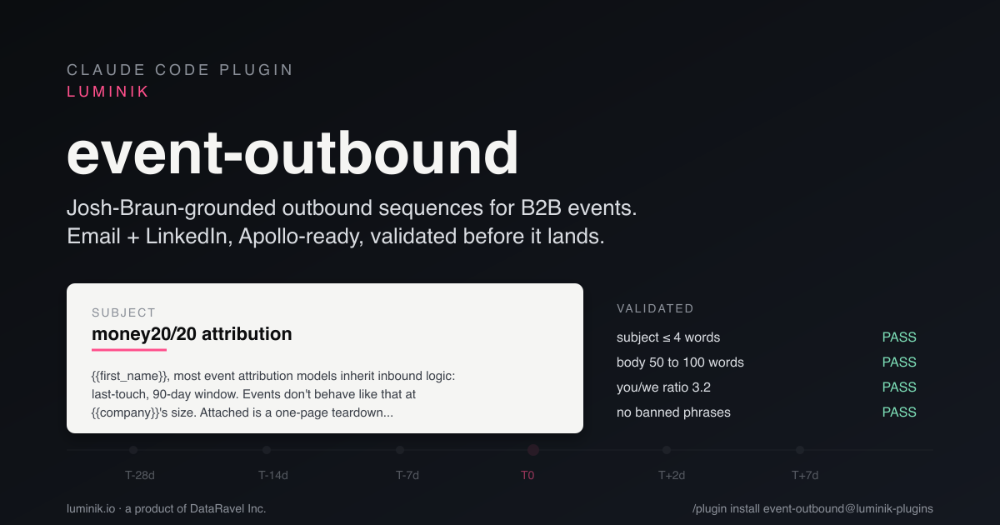

<div align="center">

<a href="https://www.luminik.io"></a>

# event-outbound

Buyer-first email and LinkedIn outreach for B2B trade shows and conferences. <br/>
Claude Code + Claude Cowork. Free, MIT, open source.

[](LICENSE)
[](https://claude.com/docs/plugins/overview)
[](#run-the-tests)
[](https://www.luminik.io)

[**Install**](#install) · [**What it does**](#what-it-does) · [**Worked examples**](#worked-examples) · [**Validation rules**](#validation-rules) · [**Why use this**](#why-use-this-over-alternatives) · [**Credits**](#credits)



</div>

---

> **Built on 20,000+ personalized touches across 50+ B2B events that sourced $6M+ in pipeline.** Distilled from four years of fintech IDV and cybersecurity outbound run by hand.

The skill turns event, ICP, sender identity, proof, real campaign assets, and cadence constraints into a full multi-touch sequence per persona, pre-event, day-of, post-event. Every touch is validated before it lands: subject ≤ 4 words, buyer-first inbox preview, channel-specific body length, no buzzwords, illumination question on first touch, direct CTA, no permission-to-send gating, no invented assets, and no unsourced proof. Failures retry up to 3× with temperature jitter; touches that exhaust retries ship with `quality_flag: 'rules_violated'` for human review.

## Install

### Claude Code

From any Claude Code session:

```bash
/plugin marketplace add luminik-io/claude-plugins
/plugin install event-outbound@luminik-plugins
```

That's it. The skill registers itself, and any prompt mentioning a B2B event, attendee outreach, or pre-event sequencing routes to it.

### Claude Cowork

Install `event-outbound` from Cowork's plugin directory once listed. In Cowork, open **Customize**, choose **Browse plugins**, then install `event-outbound`.

The same plugin package is used for Claude Code and Cowork. The local validator is referenced through `${CLAUDE_PLUGIN_ROOT}`, so it resolves inside the installed plugin directory rather than depending on the current working directory.

## Who this is for

| Audience | What you get |
|---|---|
| **AEs and SDRs** working a trade-show attendee list four weeks out | Multi-touch email + LinkedIn sequence per persona, ready for human review before loading into Apollo, Outreach, Salesloft, Instantly, or Smartlead |
| **Event marketers** running dinner invites, side events, speaker meet-and-greets, booth-visit campaigns | Channel-appropriate copy that gets opened and RSVP'd, not blasted and ignored |
| **Founders doing their own outbound** | The same workflow and the same validated output, without hiring an SDR |

Narrowed for fintech (identity verification, payments, regtech) and cybersecurity. The skill works outside those verticals, but the worked examples and the canonical pain-point library are tuned for those buyers.

## What makes this different

Every cold-email generator claims "proven frameworks." This one validates every touch against hard rules **before** it lands.

| Layer | What it checks |
|---|---|
| **Subject** | All lowercase, ≤ 4 words, no colons, no digits, no buzzwords |
| **Inbox preview** | First-touch and post-connect DM openers must be buyer-first: no seller pronouns in the first 18 words, no event-first opener |
| **Body length** | Channel-specific: cold email 50–100 words / 3–5 sentences, LinkedIn connect 18–35 words ≤ 200 chars, day-of nudge 30–60 words, post-event 40–90 words |
| **Structure** | 4T pattern: Trigger → Think (illumination question) → Third-party validation → Talk? (direct CTA) |
| **Pronoun ratio** | "you/your" must outnumber "we/our" |
| **No em-dashes, exclamation marks, or emoji** | Hard-rejected |
| **CTA ranking** | `make_offer` > `ask_for_interest` > `ask_for_problem` > `ask_for_meeting` (CTA-type reply-rate deltas from the Gong / 30MPC / Outbound Squad 85M-email report) |
| **Cadence structure** | User-configurable touch count, 4-day minimum gap by default, date-aware planning so steps do not land in the past |
| **Cliche blocklist** | Ten categories, 195 phrases. See [*Validation rules*](#validation-rules) below |
| **Specificity** | Every touch must reference a concrete persona priority, pain, or event signal, with no population-shape generalizations, forced event phrasing, or location-pasted CTAs |
| **Strict truth** | In `strictTruth` mode, asset promises require `availableAssets`, proof claims require `proofPoints`, and Apollo-ready `{{first_name}}` / `{{company}}` fields are required |

## What it does

You hand the skill five things:

1. **Event**, name, dates, agenda, speakers, exhibitor list.
2. **ICP**, industry, size range, website, and one or more buyer personas with concrete priorities and pain points (vague aspirations like "build the brand" or "scale the team" fail the specificity check).
3. **Buyer research**, buyer job, current workaround, hidden risk, likely objections, and customer-language pain.
4. **Truth sources**, proof points and assets the sender can truthfully attach or link.
5. **Sequence params**, lead time in weeks (1–8, default 4), channels (email, LinkedIn, or both), optional touch count, minimum gap days, event dates, today's date, sending identity.

If proof or assets are missing, the skill asks for them before drafting. If the user explicitly proceeds without them, strict mode writes around the gap instead of inventing matrices, briefs, peer teams, or before/after numbers.

It returns an Outbound Research Brief plus a full sequence per persona. Six touches for a four-week email-only run by default, configurable when the user wants more or fewer steps. The cadence planner enforces at least four days between adjacent touches, infers the event start from structured or human-readable dates, and uses the runtime's local date when `today` is not supplied.

## What the output looks like

A single touch from the Money20/20 Europe 2026 example (full sequence is 12 touches across two personas):

```
Touch 2 · T-14d · email cold

Subject: money20/20 attribution

{{first_name}}, the {{event_name}} line item on {{company}}'s P&L is going to
land in front of the CFO under the same last-touch, 90-day attribution rules
your inbound runs on. The booth touch is usually the 3rd interaction in an
8-month fintech cycle, so the $200K {{event_name}} spend reads as sourcing $0
by the time {{company}}'s board prep opens. Attached is a one-page recap of
how three {{title}}s rebuilt the attribution window to surface the real
number before the {{event_city}} show. Worth looking into before board prep
locks?

channel: email · offset: -14d · type: email_cold · cta: make_offer · words: 96
```

Apollo-ready merge-field syntax. The opening sentence is a specific, recipient-anchored observation, not a population-shape generalization. The CTA is a concrete offer (one-page recap), not a meeting-ask. The touch passes the full validator stack at 5/5.

## Worked examples

| Example | ICP | Personas | Lead time | Status |
|---|---|---|---|---|
| [`examples/black-hat-usa-2026/`](examples/black-hat-usa-2026/) | Cybersecurity (mid-market SaaS buyer) | Director of Security Engineering + VP Security | 4 weeks | Pre-rendered, validator-clean |
| [`examples/money2020-europe-2026/`](examples/money2020-europe-2026/) | Fintech (payments + neobank buyer) | VP Risk and Fraud + Head of Compliance / KYC Operations | 4 weeks | Pre-rendered, validator-clean |
| [`examples/singapore-fintech-festival-2026/`](examples/singapore-fintech-festival-2026/) | Fintech IDV | (input fixtures) | (n/a) | Regenerate inside Claude with no API key |

Every shipped sequence is hand-verified against the full validator stack: zero hits across the ten cliche categories, channel-length compliance, illumination-question coverage, pronoun ratio in favour of the reader.

## Quickstart

From Claude Code or Cowork, after installing the plugin:

```
Create an outbound sequence for Black Hat USA 2026 targeting Directors of Security Engineering at mid-market SaaS.
4 week lead time, email plus LinkedIn.
```

The skill picks up the request, researches public company/event context when URLs or company names are available, asks for missing proof/assets, and returns a full `SequencerOutput` plus a rendered markdown preview ready to paste into your sequencer.

### Local development

```bash
git clone https://github.com/luminik-io/event-outbound-skill.git
cd event-outbound-skill
npm install
claude --plugin-dir $(pwd)
```

That's it. The installed skill runs inside Claude Code and Cowork with no extra API keys. Claude reads the rules from `${CLAUDE_PLUGIN_ROOT}/data/`, generates each touch, validates it via `node "${CLAUDE_PLUGIN_ROOT}/scripts/validate-touch.mjs"`, and revises on failure.

To validate a single hand-written touch against the rule set:

```bash
echo '{"subject":"...","body":"...","channel":"email","touch_type":"cold_email_first_touch"}' \
  | node scripts/validate-touch.mjs --stdin
```

To run the full validator scan against every shipped artefact:

```bash
npx tsx scripts/scan-deliverables.ts
```

### Run the tests

```bash
npm test -- --run
```

100 tests across 7 files (cliche-validator unit tests, strict context checks, date-aware timeline computations, installed-skill timeline CLI, source-grounded craft evals, persona analyser, event scraper, end-to-end evals). Vitest, ~2 seconds cold.

### Headless / batch generation (optional)

If you want to generate sequences outside Claude (CI, scheduled cron, batch backfill), `src/agents/sequencer.ts` exposes `generateSequence()` with a required injectable `TouchGenerator`. Bring your own LLM adapter. There is no required cloud API for using the skill inside Claude Code or Cowork, and the repo ships no default external-model dependency.

## Parameters

Full TypeScript types in `src/types/index.ts`. The short version:

| Input | Required fields | Notes |
|---|---|---|
| `EventContext` | `name`, `dates`, optional `startDate`, optional `endDate`, `location`, `agendaTitles` | Speaker + exhibitor lists improve specificity but are optional |
| `CompanyICP` | `industry`, `sizeRange`, `personas[]` | Optional `website`, `productSummary`, `proofPoints`, and `availableAssets` improve strict-mode output |
| `AttendeePersona` | `personaId`, `role`, `seniority`, `priorities[]`, `painPoints[]` | Optional `buyerJob`, `currentWorkaround`, `hiddenRisk`, `objections`, `proofPoints`, and `availableAssets` prevent generic copy |
| `SequenceParams` | `leadTimeWeeks` (1–8), `channels`, optional `touchCount`, optional `minGapDays`, optional `today`, `sendingIdentity` | 4 weeks and 4-day gaps are the default |

## Output shape

```ts
type SequencerOutput = {
  sequencesByPersona: {
    [personaId: string]: {
      personaId: string;
      touches: OutreachTouch[];
      leadTimeWeeks: number;
      channels: ('email' | 'linkedin')[];
    };
  };
};
```

Each `OutreachTouch` carries a `checks` block so you can see exactly why it passed. Touches that burned all three validation retries return with `quality_flag: 'rules_violated'`. They are the minority, and they are your cue to rewrite by hand.

Strict mode adds `missingMergeFields`, `assetPromiseHits`, and `proofClaimHits` to the checks block so a reviewer can see whether Claude tried to invent a useful-sounding but unsourced claim.

## Validation rules

The cliche blocklist in [`data/cold-outbound-rules.json`](data/cold-outbound-rules.json) defines ten categories totalling 195 phrases. Nine are hard-banned in skill output; one is soft-warned for human review.

<!-- scan:disable -->
| Category | Phrases | Representative examples |
|---|---:|---|
| `performative_empathy` | 11 | "stuck with me", "really resonated", "got me thinking" |
| `generic_compliments` | 7 | "amazing work", "love what you're doing", "curious to hear your thoughts" |
| `sales_speak_openers` | 21 | "hope this finds you well", "circling back", "touching base", "just checking in" |
| `manufactured_intimacy` | 8 | "in case it's helpful", "no pressure at all", "if it's of interest" |
| `marketing_buzzwords` | 32 | "leverage", "unlock", "transform", "seamless", "synergy", "drive growth" |
| `cold_email_overused` | 8 | "teardown" (as 1-pager), "playbook" (as marketing word), "blueprint", "north star", "table stakes", "low-hanging fruit", "double-click on", "do you have bandwidth" |
| `lazy_generalization_openers` | 51 | "Most teams...", "Most fintechs...", "Most VPs I talk to...", "Almost nobody...", "Nobody is...", "Everyone is...", "In our experience..." |
| `llm_transition_tics` | 20 | "Moreover,", "Furthermore,", "Additionally,", "It is worth noting that" |
| `gpt_vocabulary` | 29 | "delve", "tapestry", "navigate the landscape", "in today's fast-paced world" |
| `hedge_softener_warnings` | 8 | "I think", "perhaps", "it seems" (soft-warning, not auto-rejected) |
<!-- scan:enable -->

Sources cited inline in [`data/llm-cliche-blocklist.md`](data/llm-cliche-blocklist.md): Stanford CRFM evaluations of GPT-detected vocabulary, GPTZero linguistic markers, the Lavender Live transcript, the Gong / 30MPC / Outbound Squad 85M-email "Ultimate Cold Email Data Report", and the workspace voice canon.

## Why use this over alternatives

| You're considering... | Where it falls short for event outbound |
|---|---|
| **Apollo's built-in AI email writer** | Generic templates per persona; no event-specific context (agenda, speakers, exhibitor neighbours). No validator. |
| **A custom GPT or Claude prompt you wrote yourself** | Works, but every output passes through whatever LLM cliches the base model is trained on. No reproducibility, no per-touch quality flag. |
| **Hand-writing each sequence** | The hand-written sequence is the bar this skill is calibrated against. The skill exists so you can run that bar across 10 personas in one afternoon instead of one persona per week. |
| **A general-purpose copywriter or AE training course** | Buys you craft, not throughput. This skill encodes the craft into validation rules and applies them to every touch automatically. |

## Project layout

```
.
├── src/                    Sequencer agent, validators, timeline, types
├── data/                   Validator inputs: cliche blocklist, channel rules,
│                           cold-email benchmarks, craft canon
├── examples/               Worked examples (Black Hat, Money20/20, Singapore Fintech)
├── tests/                  Vitest unit + integration tests
├── evals/                  End-to-end output evaluations
├── scripts/                Run-example, scan-deliverables, install verification
├── marketplace/            Cover image (1200x630)
└── .claude-plugin/         Claude plugin descriptor
```

## License

MIT. See [`LICENSE`](LICENSE).

## Credits

**Teachers and sources we learned from:**

- **[Josh Braun](https://joshbraun.com)**, whose public writing on buyer-first cold outbound has been a compass. The validator's tone rules (no pitch-speak, "you" > "we", concrete offers over meeting-asks) echo principles he teaches openly.
- **Gong's "Ultimate Cold Email Data Report"**, 85M emails analysed, co-authored with [30MPC](https://30mpc.com) and [Outbound Squad](https://outboundsquad.com). The benchmark numbers we validate against (subject length impact, CTA-type reply-rate deltas, word-count sweet spots) come from this publicly-published research.
- **Stanford CRFM** and **GPTZero** for public research on GPT-detected vocabulary and linguistic markers, which seeded the LLM-cliche blocklist.
- **The Lavender Live transcript**, for one of the few public corpora of in-the-moment cold-email rewrites by working SDR managers.

This plugin does not redistribute any proprietary content. It encodes general craft principles from publicly-taught material and published research into validation rules that run at generation time.

---

<div align="center">

**[Visit the skill page on luminik.io →](https://www.luminik.io/tools/event-outbound/)**

Luminik is a product of [DataRavel Inc.](https://www.luminik.io) (Newark, DE).

</div>
